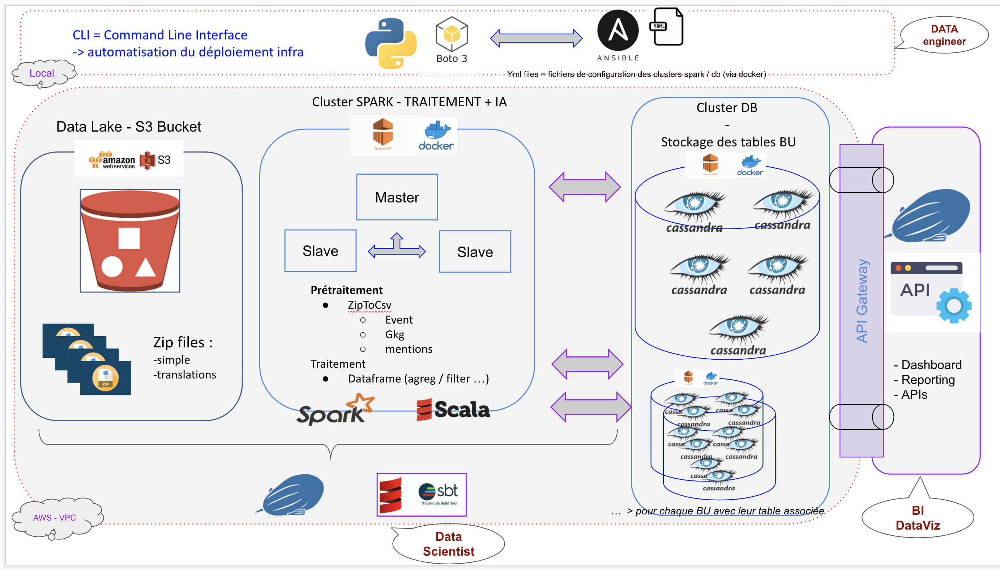

# Projet NoSQL 728 - GDELT database

The purpose of this project is to deploy an database architecture able to support more than 500 Go.
Our project was to download GDELT data from the 2020 year and see all transactions in media about Coronavirus.
For this the main goal is to think about a good architecture and easy deployable. So for this we decide to create an CLI in python connecting to AWS with their boto3 lib.
We use Ansible to manipulate easy configurable playbook and deploy the database we want and set up all configurations.

## First step : Install necessary packages
Dowload 
* [Ansible name](https://docs.ansible.com/ansible/latest/installation_guide/intro_installation.html): 2.9.15
* [AWS cli name](https://example.com): Version 2
*
           
       pip install boto3
       
## Second step : Credentials

Go to your terminal and do :

        vim ~/.aws/credentials
        
 And copy/paste your credentials from your **Accounts Details**

## Third step : KeyPair AWS and use AWS_cli.py

1. Now go to AWS console in EC2 section :

    - create your KeyPair and named it : **gdeltKeyPair** 

    - OR load the **gdeltKeyPair.pem** in secrets folder.

2. It will donwload it into your Downloads folder, you can copy/paste it to secrets project folder (the gdeltKeyPair.pem key)

3. Now you can go to project folder and run command :

       python script/AWS_cli.py --help
        
 It will show you all the command line you can do with the python interface script.
 
 For example :
 
       python script/AWS_cli.py --create_cluster spark 2 m5.xlarge
       python script/AWS_cli.py --create_cluster cassandra 2 m5.xlarge 
       python script/AWS_cli.py --create_bucket bucket_name
       python script/AWS_cli.py --upload_bucket masterfilelist.txt bucket_name
       python script/AWS_cli.py --deploy_db 5 cassandra
       
       there are others command like see all instances and create a config file with it.
       add volume in an instance
   
 The first will create the spark cluster with 2 instances (one master / one slave) and m5.xlarge instance type
 The second is the same but for the db cluster (choose between cassandra / mongodb / neo4j)
 The third and fourth are for creating the S3 bucket and upload any file you want (with the path file + filename and the S3 bucket name created)
 Finally you can deploy db with docker by selecting the number of nodes and the type
 
 ## Fourth step : Open Zeppelin from master spark cluster
 
 To use Zepellin in the spark cluster, you must allow ssh connection :
 
 1. go to the EMR spark cluster
 2. click on *Edit inbound rules* in **Security groups to Master**
 3. Add SSH rule if doesn't exist from Anywhere 
 4. go to secrets folder with gdeltKeyPair.pem key and do
 
        ssh -L 8892:127.0.0.1:8890 -i gdeltKeyPair.pem hadoop@ec2-[name of your EC2 instance spark master]
        
 5. Now you can change the interpreter parameter in Zepelin in Spark session and modify with the ip and new port 8892 go to : http://localhost:8891/#/
 
  ## Fifth step : Connect Zeppelin to Cassandra
  
  1. Add a new spark interpreter named it Spark-cassandra from spark interpeter group.
  
  2. Add spark.cassandra.connection.host and set the docker cassandra ip address (You can use the below command on the cassandra master node to see all connection)
  
    docker network inspect bridge
       
  3. Now add in dependency or maven zeppelin the follow artifact
  
    com.datastax.spark:spark-cassandra-connector-2.11:2.0.7
    
  You can now have your cassandra-spark interpreter into Zeppelin.
       
  ## Analyze
  
  We use Cassandra database and Zeppelin spark configuration.
  Now you can use Zepelin to load all csv with our code and you have to create the table corresponding to your need and configure databases and push your data after preprocessing.
  
  ## Example of architecture
 
  
   
  
  
  ##### Appendices
  
  * https://www.youtube.com/watch?reload=9&v=7LxXDrahHm0
  
  * http://www.tsoft.se/wp/2020/04/05/apache-zeppelin-with-spark-and-cassandra-the-perfect-tool/
  
  * http://www.doanduyhai.com/blog/?p=2325
  
  * https://www.gdeltproject.org
  
  
  # *Enjoy !*
